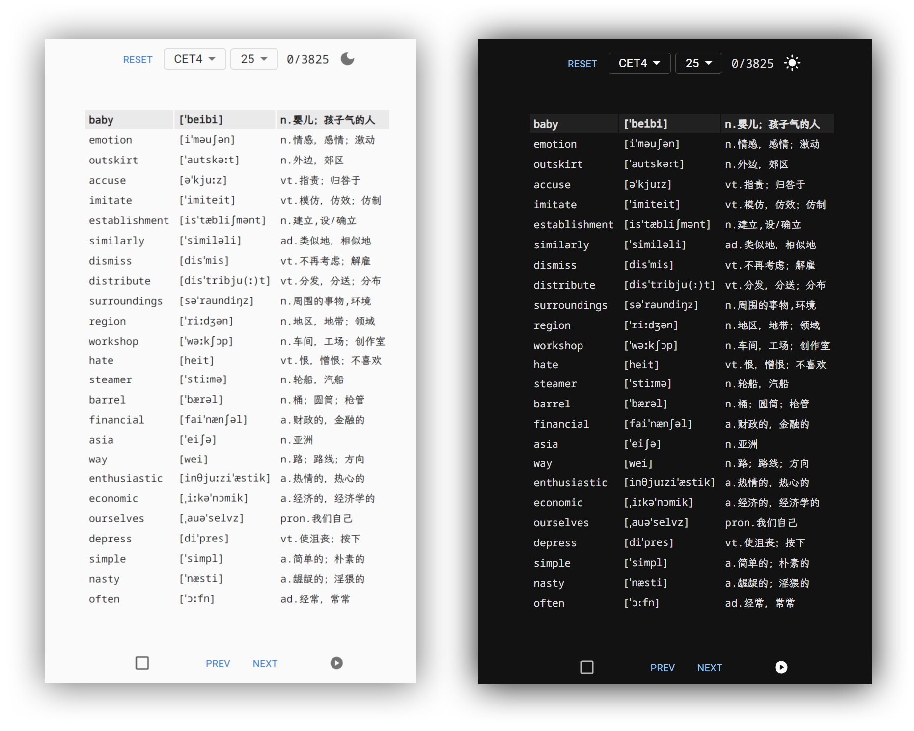

# forget words 忘记单词

简单实用的一个词根背英语单词 Web App [https://forgot-words.rj-c.run/](https://forgot-words.rj-c.run/)

手机上使用 Chrome / Edge 可以安装为 App (PWA)

发音调用了有道的接口 (默认英音，src/App.js的playAudio函数type改为2是美音)



# debug / build

``` bash
yarn install

# debug
yarn start

# build
yarn build
```